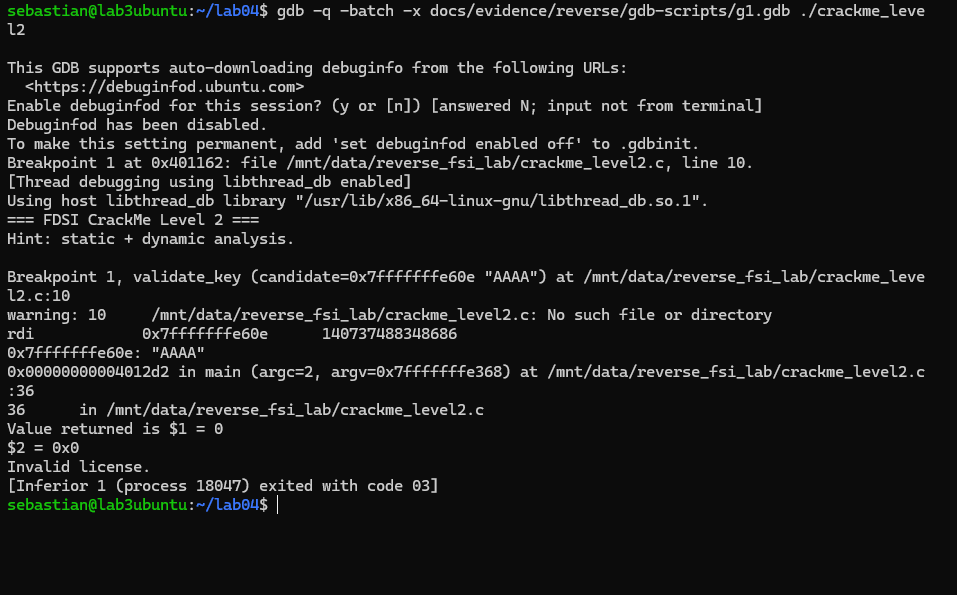
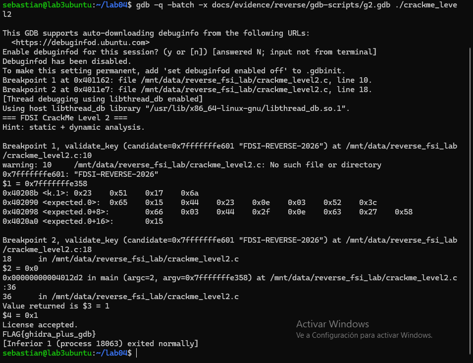
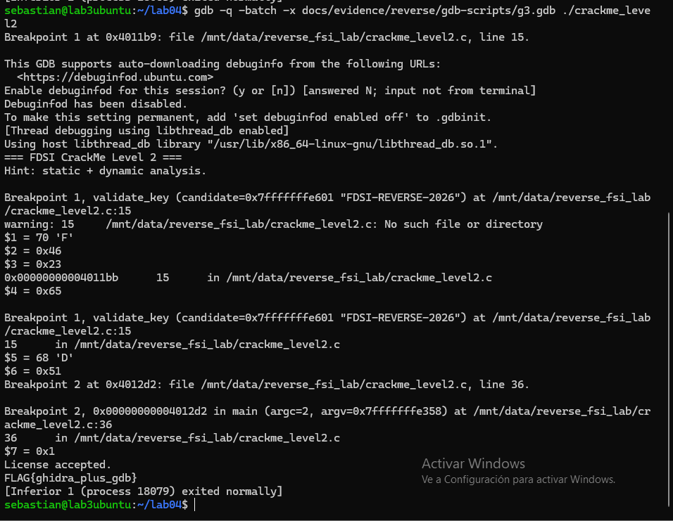
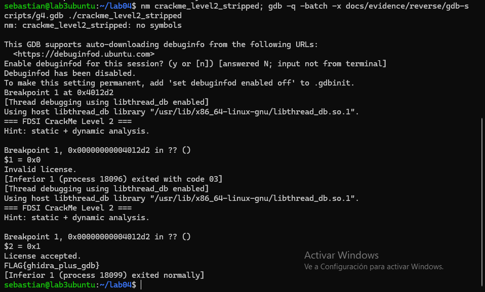

# Confirmación dinámica con GDB

Objetivo: demostrar **en ejecución** que la hipótesis de `level2.md` es correcta, es decir, que `validate_key` retorna 0 con una clave falsa y 1 con `FDSI-REVERSE-2026`.

Los scripts están en `gdb-scripts/` y la salida completa en `gdb-output.log`. Se ejecutan así:
`gdb -q -batch -x gdb-scripts/g1.gdb ./crackme_level2`

---

## 1. Clave falsa `AAAA`

```gdb
set disassembly-flavor intel
break validate_key
run AAAA
x/s $rdi        # 1er argumento (convención System V x86-64: rdi)
finish          # ejecutar hasta que la función retorne
p/x $rax        # valor de retorno
```

```text
Breakpoint 1, validate_key (candidate=0x7fffffff98f8 "AAAA")
0x7fffffff98f8:  "AAAA"
Run till exit ... Value returned is $1 = 0
$2 = 0x0
Invalid license.        [exit code 03]
```



**Interpretación:** `rdi` apunta a la cadena del usuario, lo que confirma que `validate_key(argv[1])` recibe la clave. Como `strlen("AAAA") = 4 ≠ 17`, la función retorna 0 en el primer `je` (`0x40117a`), sin llegar a entrar al bucle.

## 2. Clave correcta: leer los datos y el acumulador

```gdb
break validate_key
break *0x4011e7                       # justo después del bucle: cmp [rbp-0x4],0
run FDSI-REVERSE-2026
x/4xb  0x40208b                       # k
x/17xb 0x402090                       # expected
continue
p/x *(int*)($rbp-0x4)                 # diff acumulado
finish
p/x $rax
```

```text
0x40208b <k.1>:        0x23 0x51 0x17 0x6a
0x402090 <expected.0>: 0x65 0x15 0x44 0x23 0x0e 0x03 0x52 0x3c
0x402098:              0x66 0x03 0x44 0x2f 0x0e 0x63 0x27 0x58
0x4020a0:              0x15
Breakpoint 2 ... line 18
$2 = 0x0                 <- diff = 0: los 17 bytes coincidieron
Value returned is $3 = 1
License accepted.
FLAG{ghidra_plus_gdb}
```



**Interpretación:** los bytes de memoria coinciden con lo que se leyó estáticamente en Ghidra. Al terminar el bucle, el acumulador `diff` (`[rbp-0x4]`) vale 0, y por eso `sete al` produce 1.

## 3. Ver la transformación XOR byte a byte

Breakpoint en la instrucción `xor eax,ecx` (`0x4011b9`):

```text
Iteración i=0:
  $ecx = 0x46 'F'    <- candidate[0]
  $eax = 0x23        <- k[0 & 3]
  stepi
  $al  = 0x65        <- 'F' ^ 0x23 = 0x65 = expected[0]  ✔
Iteración i=1:
  $ecx = 0x44 'D'
  $eax = 0x51        <- k[1 & 3]
```



**Interpretación:** aquí se ve en los registros exactamente la operación del pseudocódigo, `transformado = candidata[i] XOR K[i mod 4]`, y el resultado es igual a `expected[i]`.

## 4. Boss: binario stripped (sin nombres)

`break validate_key` ya no sirve, porque no hay símbolos. Se pone el breakpoint **por dirección**, en la instrucción que sigue al `call 0x401156` dentro de `main`, para ver qué retornó la validadora:

```gdb
break *0x4012d2          # test eax,eax  (después de call FUN_00401156)
run WRONGKEY-12345678
p/x $rax
continue
run FDSI-REVERSE-2026
p/x $rax
```

```text
Breakpoint 1, 0x00000000004012d2 in ?? ()     <- "??" = no hay símbolos
$1 = 0x0          Invalid license.
Breakpoint 1, 0x00000000004012d2 in ?? ()
$2 = 0x1          License accepted.  FLAG{ghidra_plus_gdb}
```



**Interpretación:** con una clave falsa de 17 caracteres (que sí pasa el chequeo de longitud y entra al bucle), la función retorna 0. Con la clave reconstruida retorna 1. Esto confirma que `FUN_00401156` es la validadora y que el algoritmo no cambió con `strip`.

## ¿Qué aportó GDB que el análisis estático no demostraba?

- Que la función **realmente** recibe `argv[1]` en `rdi` y retorna el veredicto en `eax`.
- Los **valores reales** en memoria durante la ejecución, no solo lo que muestra el decompilador.
- La evidencia de que la hipótesis funciona: con la clave falsa el retorno es 0 y con la correcta es 1. Pasamos de "creo que es así" a "demostrado".

## Capturas (`screenshots/`)
- `gdb_fail.png`: sección 1 (retorno 0)
- `gdb_success.png`: sección 2 (bytes de `k` y `expected`, diff = 0, retorno 1)
- `gdb_xor.png`: sección 3 (registros durante el XOR)
- `boss_nm_gdb_stripped.png`: sección 4 (`nm` → no symbols, `?? ()` y retornos 0/1)
